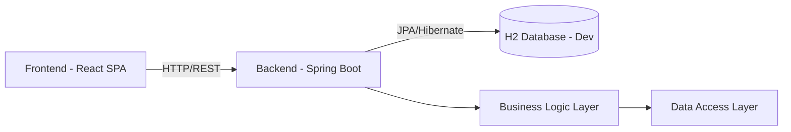
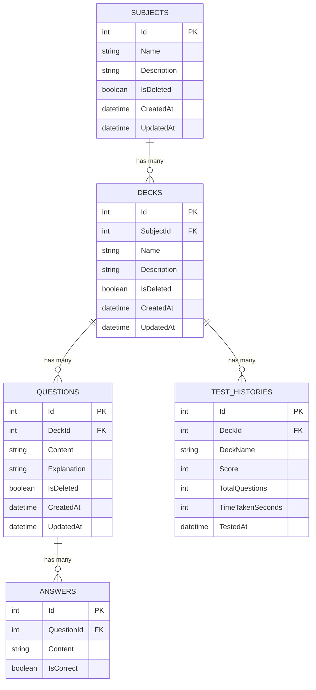
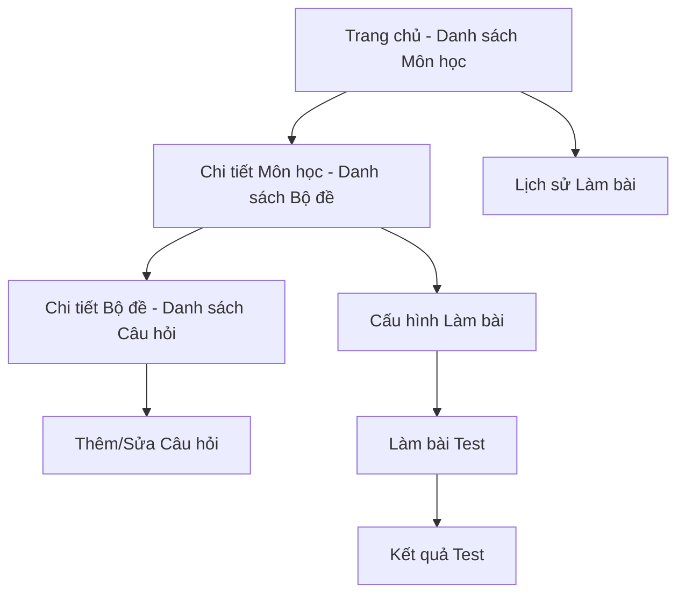

# TÀI LIỆU ĐẶC TẢ YÊU CẦU PHẦN MỀM (SRS)
## Dự án: SelfQuiz - Hệ thống Ôn tập Trắc nghiệm Cá nhân

| Thông tin | Chi tiết |
|---|---|
| **Phiên bản** | 1.2 |
| **Ngày tạo** | 2026-04-20 |
| **Tác giả** | [Tên tác giả] |
| **Trạng thái** | Draft |

### Lịch sử phiên bản

| Phiên bản | Ngày | Mô tả thay đổi |
|---|---|---|
| 1.0 | 2026-04-20 | Bản nháp ban đầu |
| 1.1 | 2026-04-20 | Bổ sung Use Case, API Spec, Acceptance Criteria, Roadmap |
| 1.2 | 2026-04-21 | Bổ sung Soft Delete, Markdown support, Pagination, Pause test, Empty deck UX, JWT security |
| 1.3 | 2026-04-21 | Fix Tech Stack, sync FR 4.1 với schema, filtered indexes, paginated response, thêm Description |

---

## Mục lục

1. [Giới thiệu chung](#1-giới-thiệu-chung)
2. [Thuật ngữ & Viết tắt](#2-thuật-ngữ--viết-tắt)
3. [Yêu cầu chức năng](#3-yêu-cầu-chức-năng)
4. [Yêu cầu phi chức năng](#4-yêu-cầu-phi-chức-năng)
5. [Thiết kế Dữ liệu](#5-thiết-kế-dữ-liệu)
6. [Đặc tả API](#6-đặc-tả-api)
7. [Thiết kế Giao diện](#7-thiết-kế-giao-diện)
8. [Kế hoạch Triển khai & Phát triển](#8-kế-hoạch-triển-khai--phát-triển)

---

## 1. Giới thiệu chung

### 1.1 Mục đích tài liệu
Tài liệu này mô tả đầy đủ các yêu cầu chức năng và phi chức năng cho hệ thống **SelfQuiz**. Đây là tài liệu tham chiếu chính cho quá trình thiết kế, phát triển và kiểm thử.

### 1.2 Phạm vi dự án
Xây dựng ứng dụng web dạng Quizlet-clone giúp người dùng:
- Tạo và quản lý bộ câu hỏi trắc nghiệm theo cấu trúc **Môn học → Bộ đề → Câu hỏi**.
- Thực hiện bài kiểm tra trắc nghiệm ngẫu nhiên từ dữ liệu tự soạn.
- Theo dõi tiến độ học tập qua lịch sử làm bài.

### 1.3 Đối tượng người dùng
- Học sinh, sinh viên muốn tự ôn tập bằng flashcard/trắc nghiệm.
- **Giai đoạn 1**: Single-user (không cần đăng nhập).
- **Giai đoạn 2**: Multi-user cơ bản (đăng ký/đăng nhập, mỗi user thấy dữ liệu riêng).

### 1.4 Các ràng buộc (Constraints)
- Dự án cá nhân, tập trung vào chức năng cốt lõi trước, UI/UX polish sau.
- Ưu tiên khả năng bảo trì và mở rộng (clean code, rõ ràng layer).
- Chưa cần tính năng real-time collaboration hay sharing bộ đề.

### 1.5 Giả định (Assumptions)
- Người dùng tự nhập câu hỏi thủ công (chưa hỗ trợ import file CSV/Excel ở giai đoạn 1).
- Mỗi câu hỏi chỉ có **đúng 1 đáp án đúng** (single-choice).
- Ứng dụng chạy trên trình duyệt hiện đại (Chrome, Firefox, Edge).

---

## 2. Thuật ngữ & Viết tắt

| Thuật ngữ | Định nghĩa |
|---|---|
| **Subject** | Môn học – đơn vị phân loại cao nhất |
| **Deck** | Bộ đề – nhóm câu hỏi thuộc một môn học |
| **Question** | Câu hỏi trắc nghiệm |
| **Answer/Option** | Đáp án/Lựa chọn của một câu hỏi |
| **Test Session** | Một phiên làm bài kiểm tra |
| **SPA** | Single Page Application |
| **ORM** | Object-Relational Mapping |
| **CRUD** | Create, Read, Update, Delete |

---

## 3. Yêu cầu chức năng

### Module 1: Quản lý Môn học & Bộ đề (Subject & Deck Management)

#### FR 1.1 – CRUD Môn học (Subjects)
- Người dùng có thể **tạo** môn học mới với tên duy nhất.
- Người dùng có thể **xem** danh sách tất cả môn học (sắp xếp theo tên hoặc ngày tạo).
- Người dùng có thể **sửa** tên môn học.
- Người dùng có thể **xóa mềm (Soft Delete)** môn học. Khi xóa, hệ thống đánh dấu `IsDeleted = true` thay vì xóa vật lý, đồng thời ẩn toàn bộ Deck, Question, Answer liên quan khỏi giao diện.

> **Acceptance Criteria:**
> - Tên môn học không được trống, tối đa 100 ký tự.
> - Không cho phép tạo 2 môn học trùng tên (case-insensitive).
> - Xóa môn học phải hiển thị dialog xác nhận kèm số lượng Deck/Question sẽ bị ẩn theo.
> - Dữ liệu đã xóa mềm không hiển thị trên UI nhưng vẫn tồn tại trong database để có thể khôi phục.

#### FR 1.2 – CRUD Bộ đề (Decks)
- Trong mỗi môn học, người dùng có thể tạo nhiều **bộ đề** (vd: *Chapter 1*, *Mid-term Review*).
- Hiển thị danh sách bộ đề kèm **số lượng câu hỏi** hiện có trong mỗi bộ đề.
- Hỗ trợ sửa tên và **xóa mềm** bộ đề (đánh dấu `IsDeleted`, ẩn Question/Answer liên quan).
- Nếu bộ đề **chưa có câu hỏi nào** (empty deck): nút "Bắt đầu làm bài" phải ở trạng thái **disabled** kèm tooltip giải thích "Bộ đề chưa có câu hỏi".

> **Acceptance Criteria:**
> - Tên bộ đề không được trống, tối đa 150 ký tự.
> - Không cho phép 2 bộ đề trùng tên trong cùng 1 môn học.
> - Khi xem danh sách bộ đề, hiển thị: tên, số câu hỏi, ngày tạo.
> - Bộ đề có 0 câu hỏi: disable nút "Bắt đầu làm bài" ngay từ danh sách, không cho vào trang cấu hình test.

---

### Module 2: Quản lý Câu hỏi (Question Management)

#### FR 2.1 – CRUD Câu hỏi
- Thêm, sửa, xóa câu hỏi trắc nghiệm trong một bộ đề cụ thể.
- Khi thêm/sửa câu hỏi, phải nhập đồng thời cả nội dung câu hỏi lẫn danh sách đáp án.

#### FR 2.2 – Cấu trúc câu hỏi

Mỗi câu hỏi **bắt buộc** phải có:

| Trường | Quy tắc |
|---|---|
| **Nội dung câu hỏi** (`Content`) | Không được trống. Tối đa 2000 ký tự. Hỗ trợ **Markdown syntax**. |
| **Danh sách đáp án** (`Answers`) | Tối thiểu **2**, tối đa **5** đáp án. |
| **Đáp án đúng** (`IsCorrect`) | Chính xác **1** đáp án được đánh dấu `IsCorrect = true`. |
| **Giải thích** (`Explanation`) | **Bắt buộc**. Hiển thị khi người dùng làm sai. Tối đa 3000 ký tự. Hỗ trợ **Markdown syntax**. |

> [!IMPORTANT]
> **Hỗ trợ Markdown/Rich Text**: Trường `Content` và `Explanation` lưu dưới dạng **Markdown** trong database (NVARCHAR). Frontend sẽ render Markdown thành HTML khi hiển thị. Điều này cho phép nhúng **code snippet** (` ``` `), **công thức toán học**, **bảng**, **bold/italic**, v.v. Đáp án (`Answer.Content`) cũng hỗ trợ inline Markdown cơ bản.

> **Acceptance Criteria:**
> - Không thể lưu câu hỏi nếu thiếu bất kỳ trường bắt buộc nào.
> - Nếu đánh dấu nhiều hơn 1 đáp án đúng → hiển thị lỗi validation.
> - Nếu số đáp án < 2 hoặc > 5 → hiển thị lỗi validation.
> - Nội dung đáp án không được trống, tối đa 500 ký tự mỗi đáp án.
> - Markdown trong Content/Explanation phải được render chính xác trên cả trang làm bài lẫn trang kết quả.

#### FR 2.3 – Tìm kiếm & Lọc câu hỏi *(Nice-to-have – Giai đoạn 2)*
- Tìm kiếm câu hỏi theo từ khóa trong nội dung.
- Lọc câu hỏi theo bộ đề hoặc môn học.

---

### Module 3: Chế độ Làm bài (Test Engine)

#### FR 3.1 – Cấu hình Test
- Người dùng chọn **một bộ đề** và nhập **số lượng câu hỏi** mong muốn (N).
- Hệ thống validate: `1 ≤ N ≤ Tổng số câu hỏi trong bộ đề`.
- Nếu bộ đề có ít hơn N câu → hiển thị thông báo và cho phép chọn lại.
- **Nếu bộ đề có 0 câu hỏi**: Không cho phép truy cập trang cấu hình test. Nút "Bắt đầu làm bài" phải disabled ngay từ danh sách bộ đề (xem FR 1.2).

#### FR 3.2 – Thuật toán Random
- Truy xuất **ngẫu nhiên** N câu hỏi từ bộ đề được chọn.
- Đảm bảo **không trùng lặp** (mỗi câu chỉ xuất hiện 1 lần trong 1 bài test).
- Phương án:
  - **SQL Server**: `SELECT TOP(N) ... ORDER BY NEWID()`
  - **Business Logic**: Fisher-Yates shuffle trên danh sách ID rồi lấy N phần tử đầu.

#### FR 3.3 – Xáo trộn Đáp án
- Trước khi render UI, **xáo trộn ngẫu nhiên thứ tự đáp án** của mỗi câu hỏi.
- Sử dụng **Fisher-Yates shuffle** ở tầng Business Logic.
- Đảm bảo mỗi lần làm bài, thứ tự đáp án lại khác nhau.

#### FR 3.4 – Giao diện làm bài
- Hiển thị câu hỏi dạng **từng câu một** (one-by-one) hoặc **tất cả** (scrollable list) – cho phép người dùng chọn chế độ.
- Hiển thị thanh tiến trình (progress bar): *Câu X / N*.
- Cho phép **đánh dấu câu hỏi** (flag) để quay lại sau.
- Nút **Nộp bài** chỉ active khi đã trả lời hết hoặc hiển thị cảnh báo nếu còn câu chưa trả lời.
- Render nội dung câu hỏi và đáp án dưới dạng **Markdown** (hỗ trợ code snippet, bold/italic).

#### FR 3.5 – Chấm điểm (Grading)
- Hệ thống tự động đối chiếu đáp án người dùng chọn với `IsCorrect` trong DB.
- Tính điểm: `Số câu đúng / Tổng số câu × 100%`.

#### FR 3.6 – Tạm dừng bài test *(Giai đoạn 2)*
- Cho phép người dùng **tạm dừng (Pause)** bài test đang làm dở.
- Khi pause: dừng đếm thời gian, lưu trạng thái hiện tại (câu đã trả lời, câu đang ở) vào `localStorage` hoặc server.
- Khi resume: khôi phục trạng thái và tiếp tục đếm thời gian.
- `TimeTakenSeconds` chỉ tính thời gian thực tế làm bài (không bao gồm thời gian pause).

#### FR 3.7 – Hiển thị Kết quả
Màn hình kết quả bao gồm:

| Thành phần | Mô tả |
|---|---|
| **Điểm tổng** | `X/N` câu đúng, tỷ lệ `%`, kèm đánh giá (Excellent / Good / Need Improvement) |
| **Thời gian làm bài** | Tổng thời gian thực tế (không tính pause) |
| **Danh sách câu hỏi** | Hiển thị tất cả câu, đánh dấu ✅ đúng / ❌ sai |
| **Giải thích chi tiết** | Hiện `Explanation` (rendered Markdown) ngay dưới mỗi **câu sai** |
| **Đáp án đúng** | Highlight đáp án đúng cho những câu làm sai |

> **Acceptance Criteria:**
> - Sau khi nộp bài, kết quả hiển thị trong < 2 giây.
> - Có nút "Làm lại bộ đề này" và "Quay về trang chủ".
> - Kết quả được lưu tự động vào Test History.

---

### Module 4: Lịch sử & Thống kê (History & Analytics)

#### FR 4.1 – Lưu lịch sử làm bài
Mỗi record lịch sử bao gồm:

| Trường | Kiểu dữ liệu | Ghi chú |
|---|---|---|
| `Id` | Auto-increment | PK |
| `DeckId` | FK → Decks (nullable) | `ON DELETE SET NULL` – giữ history khi Deck bị xóa |
| `DeckName` | string | Snapshot tên Deck tại thời điểm làm bài |
| `Score` | int | Số câu đúng |
| `TotalQuestions` | int | Tổng số câu |
| `TimeTakenSeconds` | int (nullable) | Thời gian thực tế làm bài (giây) |
| `TestedAt` | DateTime | Thời điểm nộp bài |

#### FR 4.2 – Xem lịch sử
- Danh sách lịch sử sắp xếp theo **ngày làm gần nhất**.
- Lọc theo **môn học** hoặc **bộ đề**.
- Hiển thị: Tên bộ đề, Điểm, Ngày làm, Thời gian.

#### FR 4.3 – Thống kê cơ bản *(Giai đoạn 2)*
- Biểu đồ đường (line chart) thể hiện **điểm số theo thời gian** cho mỗi bộ đề.
- Thống kê: điểm trung bình, điểm cao nhất, số lần làm bài.
- Xác định **câu hỏi hay sai nhất** (most missed questions) – cần lưu thêm chi tiết câu trả lời.

#### FR 4.4 – Xóa lịch sử
- Cho phép xóa từng record hoặc xóa toàn bộ lịch sử của một bộ đề.

---

### Module 5: Quản lý Người dùng *(Giai đoạn 2)*

#### FR 5.1 – Đăng ký / Đăng nhập
- Đăng ký bằng email + mật khẩu.
- Đăng nhập bằng email + mật khẩu.
- Phát hành JWT token khi đăng nhập thành công.

#### FR 5.2 – Quên mật khẩu (Forgot Password)
- Người dùng nhập email → hệ thống gửi link reset mật khẩu qua email.
- Link reset chứa `ResetPasswordToken` có thời hạn (mặc định 1 giờ).
- Cần bổ sung cột `ResetPasswordToken (NVARCHAR)` và `ResetTokenExpiry (DATETIME2)` vào bảng `Users`.

#### FR 5.3 – Phân tách dữ liệu
- Mỗi user chỉ thấy và thao tác trên dữ liệu của mình.
- Tất cả các bảng dữ liệu thêm cột `UserId (FK)`.

---

## 4. Yêu cầu phi chức năng

### 4.1 Kiến trúc hệ thống



**Kiến trúc 3-layer:**

| Layer | Trách nhiệm | Công nghệ |
|---|---|---|
| **Presentation** | Nhận request, validate input, trả response | Spring Boot `@RestController` |
| **Business Logic** | Xử lý nghiệp vụ, shuffle, grading | `@Service` classes |
| **Data Access** | Truy vấn DB, mapping entity | Spring Data JPA Repository |

### 4.2 Tech Stack

| Thành phần | Lựa chọn | Ghi chú |
|---|---|---|
| **Backend** | Spring Boot 3.x (Java 17+) | RESTful API |
| **ORM** | Spring Data JPA + Hibernate | |
| **Database (Dev)** | H2 (embedded) | Zero-config, switch sang SQL Server cho production |
| **Database (Prod)** | SQL Server | Khi cần deploy |
| **Frontend** | React 18 + Vite | SPA, client-side routing |
| **Routing** | React Router v6 | |
| **HTTP Client** | Axios | |
| **Markdown** | react-markdown + react-syntax-highlighter | Render code snippet, formula |
| **Build Tool** | Maven (via Maven Wrapper) | |

### 4.3 Hiệu năng (Performance)

| Yêu cầu | Mục tiêu |
|---|---|
| Thời gian tạo bài test (random + shuffle) | < 1 giây |
| Thời gian load danh sách môn học / bộ đề | < 500ms |
| Thời gian chấm điểm và hiển thị kết quả | < 2 giây |
| Kích thước bundle Frontend (gzipped) | < 500KB |

### 4.4 Bảo mật (Security)
- **SQL Injection**: Sử dụng Parameterized Queries hoặc ORM → phòng tránh 100%.
- **XSS**: Escape tất cả user input trước khi render ra HTML. Đặc biệt cẩn thận khi render Markdown → HTML (sử dụng thư viện sanitizer).
- **CORS**: Cấu hình chỉ cho phép origin của Frontend.
- **Password Hashing** *(Giai đoạn 2)*: BCrypt với salt rounds ≥ 10.
- **Authentication** *(Giai đoạn 2)*: JWT Bearer Token, token expiry 24h.
- **Input Validation**: Validate cả phía client (UX) lẫn server (bảo mật).

> [!WARNING]
> **Lưu trữ JWT Token (Giai đoạn 2)**: Không lưu JWT trong `localStorage` (dễ bị tấn công XSS). Thay vào đó:
> - Sử dụng **HttpOnly Cookie** để lưu Refresh Token (không thể truy cập từ JavaScript).
> - Access Token ngắn hạn (15 phút) lưu trong memory (biến JS).
> - Kết hợp `SameSite=Strict` và `Secure` flag trên cookie.

### 4.5 Rate Limiting *(Giai đoạn 2)*
- Cấu hình giới hạn request: **100 requests/phút/IP** cho API thông thường.
- Endpoint nhạy cảm (`/api/v1/tests/generate`, `/api/v1/auth/login`): **20 requests/phút/IP**.
- Sử dụng Spring Boot `bucket4j` hoặc `resilience4j` để implement.
- Trả về `429 Too Many Requests` khi vượt giới hạn.

### 4.6 Giao diện (UI/UX)
- **Responsive**: Hoạt động tốt trên Desktop (≥ 1024px) và Mobile (≥ 375px).
- **Design**: Tối giản, tập trung vào text, câu hỏi dạng Card.
- **Accessibility**: Contrast ratio tối thiểu 4.5:1 (WCAG AA).
- **Loading States**: Hiển thị skeleton/spinner khi đang fetch data.
- **Error Handling**: Hiển thị thông báo lỗi rõ ràng, không để trang trắng.
- **Toast/Notification**: Thông báo thành công khi CRUD (tạo, sửa, xóa).
- **Empty States**: Hiển thị thông báo hướng dẫn rõ ràng khi danh sách trống ("Chưa có môn học nào. Bấm + để tạo mới").
- **Markdown Rendering**: Sử dụng thư viện `react-markdown` + `react-syntax-highlighter` để render code snippet trong câu hỏi.

### 4.7 Khả năng bảo trì (Maintainability)
- Code tuân theo **SOLID principles**.
- Tách biệt rõ ràng giữa các layer, không gọi trực tiếp Data Access từ Controller.
- Sử dụng **Dependency Injection** cho tất cả service.
- Đặt tên biến, hàm, class rõ ràng theo convention (camelCase cho Java/JS).
- Soft Delete logic nên được xử lý tập trung (base entity hoặc JPA `@Where` annotation) để tránh quên filter `IsDeleted`.

### 4.8 Kiểm thử (Testing)
- **Unit Test**: Tối thiểu cho Business Logic layer (shuffle, grading, validation).
- **Integration Test** *(Nice-to-have)*: Test API endpoints với in-memory database.
- **Coverage mục tiêu**: ≥ 70% cho Business Logic layer.

---

## 5. Thiết kế Dữ liệu

### 5.1 Entity Relationship Diagram



> [!NOTE]
> **Chiến lược Soft Delete**: Cột `IsDeleted` được thêm vào `Subjects`, `Decks`, `Questions`. Bảng `Answers` không cần `IsDeleted` riêng vì luôn gắn liền với Question. Bảng `TestHistories` **không soft delete** – lịch sử làm bài được giữ nguyên ngay cả khi Deck/Question bị xóa mềm (nhờ đó giữ được dữ liệu thống kê).

### 5.2 Bảng chi tiết

#### Bảng `Subjects`
| Cột | Kiểu | Ràng buộc |
|---|---|---|
| `Id` | INT | PK, Identity |
| `Name` | NVARCHAR(100) | NOT NULL, UNIQUE (among non-deleted) |
| `Description` | NVARCHAR(500) | NULL |
| `IsDeleted` | BIT | NOT NULL, DEFAULT 0 |
| `CreatedAt` | DATETIME2 | NOT NULL, DEFAULT GETDATE() |
| `UpdatedAt` | DATETIME2 | NULL |

#### Bảng `Decks`
| Cột | Kiểu | Ràng buộc |
|---|---|---|
| `Id` | INT | PK, Identity |
| `SubjectId` | INT | FK → Subjects(Id) |
| `Name` | NVARCHAR(150) | NOT NULL |
| `Description` | NVARCHAR(500) | NULL |
| `IsDeleted` | BIT | NOT NULL, DEFAULT 0 |
| `CreatedAt` | DATETIME2 | NOT NULL, DEFAULT GETDATE() |
| `UpdatedAt` | DATETIME2 | NULL |

> UNIQUE constraint trên (`SubjectId`, `Name`) – chỉ áp dụng trong các record chưa bị xóa (`IsDeleted = 0`).

#### Bảng `Questions`
| Cột | Kiểu | Ràng buộc |
|---|---|---|
| `Id` | INT | PK, Identity |
| `DeckId` | INT | FK → Decks(Id) |
| `Content` | NVARCHAR(2000) | NOT NULL. Lưu dạng Markdown. |
| `Explanation` | NVARCHAR(3000) | NOT NULL. Lưu dạng Markdown. |
| `IsDeleted` | BIT | NOT NULL, DEFAULT 0 |
| `CreatedAt` | DATETIME2 | NOT NULL, DEFAULT GETDATE() |
| `UpdatedAt` | DATETIME2 | NULL |

#### Bảng `Answers`
| Cột | Kiểu | Ràng buộc |
|---|---|---|
| `Id` | INT | PK, Identity |
| `QuestionId` | INT | FK → Questions(Id), ON DELETE CASCADE |
| `Content` | NVARCHAR(500) | NOT NULL. Hỗ trợ inline Markdown. |
| `IsCorrect` | BIT | NOT NULL, DEFAULT 0 |

> `Answers` vẫn dùng ON DELETE CASCADE vì luôn tồn tại cùng Question (không soft delete riêng).

#### Bảng `TestHistories`
| Cột | Kiểu | Ràng buộc |
|---|---|---|
| `Id` | INT | PK, Identity |
| `DeckId` | INT | FK → Decks(Id), ON DELETE SET NULL |
| `DeckName` | NVARCHAR(150) | NOT NULL (snapshot tên Deck tại thời điểm làm bài) |
| `Score` | INT | NOT NULL |
| `TotalQuestions` | INT | NOT NULL |
| `TimeTakenSeconds` | INT | NULL |
| `TestedAt` | DATETIME2 | NOT NULL, DEFAULT GETDATE() |

> `DeckId` dùng ON DELETE SET NULL + lưu snapshot `DeckName` để lịch sử vẫn hiển thị được ngay cả khi Deck bị xóa.

### 5.3 Bảng bổ sung cho Giai đoạn 2

#### Bảng `Users`
| Cột | Kiểu | Ràng buộc |
|---|---|---|
| `Id` | INT | PK, Identity |
| `Email` | NVARCHAR(255) | NOT NULL, UNIQUE |
| `PasswordHash` | NVARCHAR(255) | NOT NULL |
| `DisplayName` | NVARCHAR(100) | NOT NULL |
| `ResetPasswordToken` | NVARCHAR(255) | NULL |
| `ResetTokenExpiry` | DATETIME2 | NULL |
| `CreatedAt` | DATETIME2 | NOT NULL, DEFAULT GETDATE() |

> Giai đoạn 2: Thêm cột `UserId (FK → Users)` vào bảng `Subjects`.

#### Bảng `TestAnswerDetails` *(cho tính năng "câu hay sai nhất")*
| Cột | Kiểu | Ràng buộc |
|---|---|---|
| `Id` | INT | PK, Identity |
| `TestHistoryId` | INT | FK → TestHistories(Id), ON DELETE CASCADE |
| `QuestionId` | INT | FK → Questions(Id) |
| `SelectedAnswerId` | INT | FK → Answers(Id) |
| `IsCorrect` | BIT | NOT NULL |

### 5.4 Indexes khuyến nghị
```sql
-- Filtered index: chỉ index các record chưa bị xóa mềm
CREATE INDEX IX_Subjects_Active ON Subjects(Name) WHERE IsDeleted = 0;

-- Tăng tốc query lấy Deck theo Subject (chỉ active)
CREATE INDEX IX_Decks_SubjectId ON Decks(SubjectId) WHERE IsDeleted = 0;

-- Tăng tốc query lấy Question theo Deck (chỉ active)
CREATE INDEX IX_Questions_DeckId ON Questions(DeckId) WHERE IsDeleted = 0;

-- Tăng tốc query lấy Answer theo Question
CREATE INDEX IX_Answers_QuestionId ON Answers(QuestionId);

-- Tăng tốc query lịch sử theo Deck và thời gian
CREATE INDEX IX_TestHistories_DeckId_TestedAt ON TestHistories(DeckId, TestedAt DESC);
```

> [!TIP]
> **Filtered Indexes** (`WHERE IsDeleted = 0`): Chỉ index các bản ghi active, giúp nhỏ gọn index và tăng tốc query so với index toàn bộ bảng. Lưu ý: H2 không hỗ trợ filtered index – chỉ áp dụng khi chuyển sang SQL Server.

---

## 6. Đặc tả API

### 6.1 Quy ước chung
- Base URL: `/api/v1`
- Response format: JSON
- HTTP Status Codes chuẩn: `200 OK`, `201 Created`, `204 No Content`, `400 Bad Request`, `404 Not Found`, `429 Too Many Requests`, `500 Internal Server Error`
- **Pagination**: Tất cả API trả về danh sách đều hỗ trợ phân trang với query params `?page=0&size=20&sort=createdAt,desc`
- Soft-deleted records tự động bị lọc khỏi tất cả response (trừ API admin nếu có)
- **DELETE** endpoints thực hiện **soft delete** (đánh dấu `IsDeleted = true`), không xóa vật lý

**Response format cho paginated endpoints:**
```json
{
  "content": [ ... ],
  "page": {
    "number": 0,
    "size": 20,
    "totalElements": 150,
    "totalPages": 8
  }
}
```

### 6.2 Endpoints

#### Subjects

| Method | Endpoint | Mô tả |
|---|---|---|
| `GET` | `/api/v1/subjects` | Lấy danh sách tất cả môn học |
| `GET` | `/api/v1/subjects/{id}` | Lấy chi tiết 1 môn học |
| `POST` | `/api/v1/subjects` | Tạo môn học mới |
| `PUT` | `/api/v1/subjects/{id}` | Cập nhật tên môn học |
| `DELETE` | `/api/v1/subjects/{id}` | Xóa mềm môn học (cascade soft delete Decks, Questions) |

**Request Body mẫu (POST/PUT):**
```json
{
  "name": "Software Architecture"
}
```

**Response mẫu (GET list):**
```json
[
  {
    "id": 1,
    "name": "Software Architecture",
    "deckCount": 3,
    "createdAt": "2026-04-20T10:00:00Z"
  }
]
```

---

#### Decks

| Method | Endpoint | Mô tả |
|---|---|---|
| `GET` | `/api/v1/subjects/{subjectId}/decks` | Lấy danh sách bộ đề của môn học |
| `GET` | `/api/v1/decks/{id}` | Lấy chi tiết bộ đề |
| `POST` | `/api/v1/subjects/{subjectId}/decks` | Tạo bộ đề mới |
| `PUT` | `/api/v1/decks/{id}` | Cập nhật bộ đề |
| `DELETE` | `/api/v1/decks/{id}` | Xóa mềm bộ đề (cascade soft delete Questions) |

**Response mẫu (GET list):**
```json
[
  {
    "id": 1,
    "subjectId": 1,
    "name": "Chapter 1",
    "questionCount": 25,
    "createdAt": "2026-04-20T10:00:00Z"
  }
]
```

---

#### Questions

| Method | Endpoint | Mô tả |
|---|---|---|
| `GET` | `/api/v1/decks/{deckId}/questions?page=0&size=20` | Lấy danh sách câu hỏi (phân trang) |
| `GET` | `/api/v1/questions/{id}` | Lấy chi tiết 1 câu hỏi (kèm answers) |
| `POST` | `/api/v1/decks/{deckId}/questions` | Tạo câu hỏi mới (kèm answers) |
| `PUT` | `/api/v1/questions/{id}` | Cập nhật câu hỏi |
| `DELETE` | `/api/v1/questions/{id}` | Xóa mềm câu hỏi (set IsDeleted=true) |

**Request Body mẫu (POST):**
```json
{
  "content": "Kiến trúc phần mềm nào phù hợp nhất cho microservices?",
  "explanation": "SOA (Service-Oriented Architecture) là tiền thân, nhưng Microservices Architecture được thiết kế riêng cho...",
  "answers": [
    { "content": "Monolithic Architecture", "isCorrect": false },
    { "content": "Microservices Architecture", "isCorrect": true },
    { "content": "Pipe-and-Filter", "isCorrect": false },
    { "content": "Client-Server", "isCorrect": false }
  ]
}
```

---

#### Test Engine

| Method | Endpoint | Mô tả |
|---|---|---|
| `POST` | `/api/v1/tests/generate` | Tạo bài test ngẫu nhiên |
| `POST` | `/api/v1/tests/submit` | Nộp bài và nhận kết quả |

**Request – Generate Test:**
```json
{
  "deckId": 1,
  "numberOfQuestions": 10
}
```

**Response – Generate Test:**
```json
{
  "testSessionId": "guid-...",
  "deckName": "Chapter 1",
  "questions": [
    {
      "questionId": 42,
      "content": "...",
      "answers": [
        { "answerId": 101, "content": "Option A" },
        { "answerId": 102, "content": "Option B" },
        { "answerId": 103, "content": "Option C" },
        { "answerId": 104, "content": "Option D" }
      ]
    }
  ]
}
```

> ⚠️ Response **KHÔNG** chứa `isCorrect` – tránh gian lận phía client.

**Request – Submit Test:**
```json
{
  "testSessionId": "guid-...",
  "deckId": 1,
  "timeTakenSeconds": 300,
  "answers": [
    { "questionId": 42, "selectedAnswerId": 102 },
    { "questionId": 17, "selectedAnswerId": 55 }
  ]
}
```

**Response – Submit Test:**
```json
{
  "score": 8,
  "totalQuestions": 10,
  "percentage": 80.0,
  "evaluation": "Good",
  "timeTakenSeconds": 300,
  "results": [
    {
      "questionId": 42,
      "content": "...",
      "isCorrect": true,
      "selectedAnswerId": 102,
      "correctAnswerId": 102,
      "explanation": null
    },
    {
      "questionId": 17,
      "content": "...",
      "isCorrect": false,
      "selectedAnswerId": 55,
      "correctAnswerId": 58,
      "explanation": "Giải thích chi tiết..."
    }
  ]
}
```

---

#### Test History

| Method | Endpoint | Mô tả |
|---|---|---|
| `GET` | `/api/v1/test-histories` | Lấy toàn bộ lịch sử (hỗ trợ filter by deckId) |
| `GET` | `/api/v1/test-histories/{id}` | Chi tiết 1 lần làm bài |
| `DELETE` | `/api/v1/test-histories/{id}` | Xóa 1 record lịch sử |

---

## 7. Thiết kế Giao diện

### 7.1 Sitemap



### 7.2 Mô tả các màn hình chính

| # | Màn hình | Thành phần chính |
|---|---|---|
| 1 | **Trang chủ** | Grid/List các Subject card, nút "Thêm môn học", link "Lịch sử" |
| 2 | **Chi tiết Môn học** | Breadcrumb, danh sách Deck card (hiển thị question count), nút thêm/sửa/xóa |
| 3 | **Chi tiết Bộ đề** | Danh sách câu hỏi (accordion/collapsible), nút "Bắt đầu làm bài", nút thêm câu hỏi |
| 4 | **Form Câu hỏi** | Modal hoặc trang riêng, input content + explanation + dynamic answer fields |
| 5 | **Cấu hình Test** | Chọn số câu, chọn chế độ hiển thị (one-by-one / all), nút "Bắt đầu" |
| 6 | **Làm bài** | Card câu hỏi, radio buttons cho đáp án, progress bar, nút flag, nút nộp bài |
| 7 | **Kết quả** | Score summary, danh sách review câu hỏi, highlight đúng/sai, explanation |
| 8 | **Lịch sử** | Table/List lịch sử, filter by subject/deck, sắp xếp theo ngày |

---

## 8. Kế hoạch Triển khai & Phát triển

### 8.1 Roadmap theo giai đoạn

#### 🟢 Giai đoạn 1 – MVP (4-6 tuần)
- [x] Thiết kế database, setup project Backend + Frontend
- [ ] Module 1: CRUD Subjects & Decks
- [ ] Module 2: CRUD Questions & Answers
- [ ] Module 3: Test Engine (generate, làm bài, chấm điểm, kết quả)
- [ ] Module 4: Lịch sử làm bài (basic list)
- [ ] Testing cơ bản + Deploy

#### 🟡 Giai đoạn 2 – Enhancement (3-4 tuần)
- [ ] Module 5: User Authentication (JWT + HttpOnly Cookie)
- [ ] FR 5.2: Quên mật khẩu (Forgot Password)
- [ ] FR 3.6: Tạm dừng bài test (Pause/Resume)
- [ ] FR 4.3: Biểu đồ thống kê
- [ ] FR 2.3: Tìm kiếm & lọc câu hỏi
- [ ] Bảng `TestAnswerDetails` + tính năng "câu hay sai nhất"
- [ ] Import câu hỏi từ CSV/Excel
- [ ] Rate Limiting (100 req/min/IP)

#### 🔵 Giai đoạn 3 – Advanced *(Tùy chọn)*
- [ ] Chế độ Flashcard (lật thẻ)
- [ ] Sharing bộ đề (public link)
- [ ] Spaced Repetition (ôn tập lặp lại theo lịch)
- [ ] Dark mode / Theme customization
- [ ] PWA support (offline access)

### 8.2 Môi trường triển khai

| Môi trường | Mô tả |
|---|---|
| **Development** | localhost, SQL Server LocalDB / Docker |
| **Staging** *(Optional)* | Azure App Service Free Tier / Railway |
| **Production** *(Optional)* | Azure / AWS / VPS |

### 8.3 Source Control
- Git + GitHub/GitLab
- Branching strategy: `main` ← `develop` ← `feature/xxx`
- Commit message convention: `feat:`, `fix:`, `docs:`, `refactor:`

---

> [!NOTE]
> Tài liệu này là phiên bản nâng cấp từ bản mô tả ban đầu. Các phần được bổ sung bao gồm: **Acceptance Criteria** chi tiết, **Đặc tả API** đầy đủ, **ER Diagram** dạng Mermaid, **Sitemap**, **Roadmap**, **Indexes**, và các bảng bổ sung cho Giai đoạn 2.
